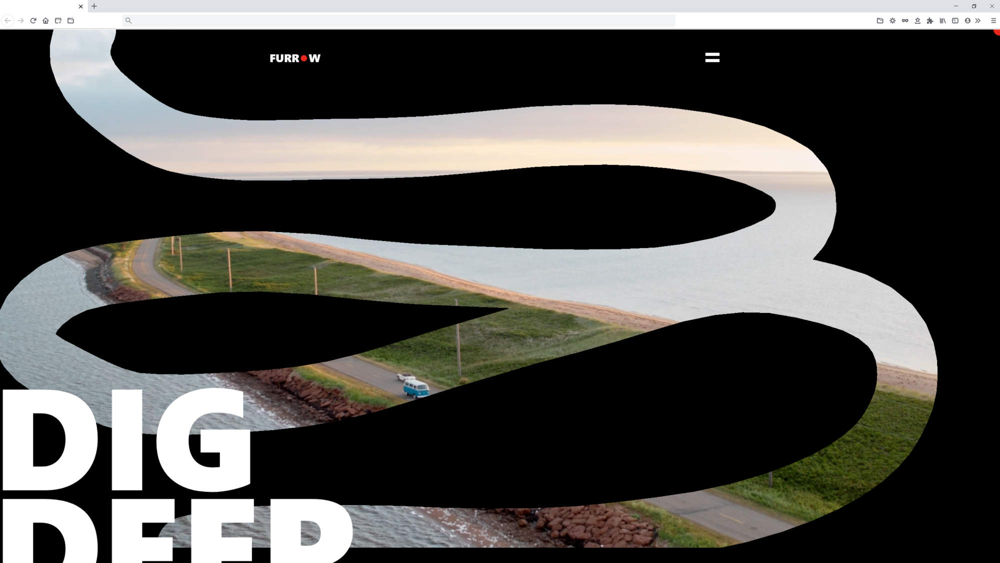

# Furrow

Furrow is a studio that focuses on video production and post production. This project is a clone of their current homepage, with some improved performance, in order to sharpen my web development skills. During this project I learned how to implement NextJS in combination with typescript's static typing. This project has a [demo](https://luisvilla.xyz/projects/nike/demo) on my personal website.

Visit my [personal website](https://luisvilla.xyz) if you'd like to see more of my projects.

## Site

### Landing Page

A website designed with both mobile and desktop views in minds. Enjoy snappy load times with minimal animation for smaller mobile screens and impressive interactions on larger desktop screens. Erase away the canvas to reveal the content in the site's landing section or toggle the website's theme between light and dark mode to match your current mood.

## Setup

- This project requires [NodeJS](https://nodejs.org/en/).
- Clone the repository and run `npm i` or `npm install` to download all required modules.
- Once downloaded, run `npm run dev`.
- The project should open at [http://localhost:3000](http://localhost:3000).

## Technologies Used

- Frontend
  - next - version 11.1.0,
  - react - version 17.0.2,
  - typescript - version 4.3.5
  - framer-motion - version 4.1.17,
  - sass - version 1.37.5
